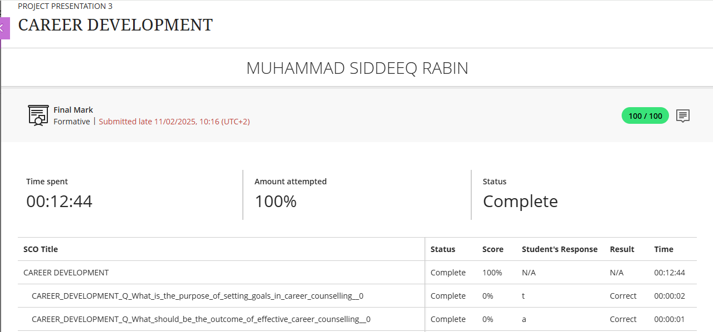
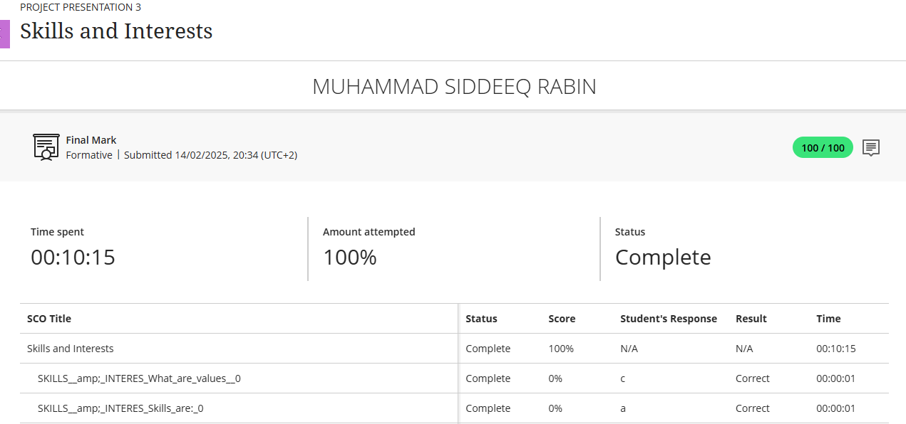
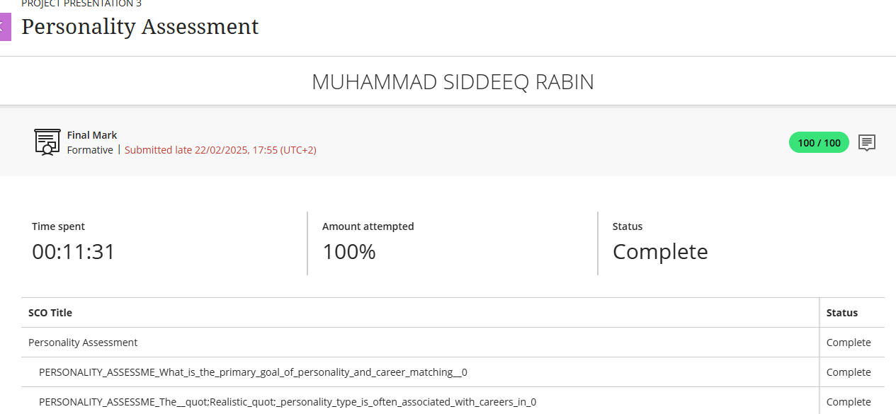
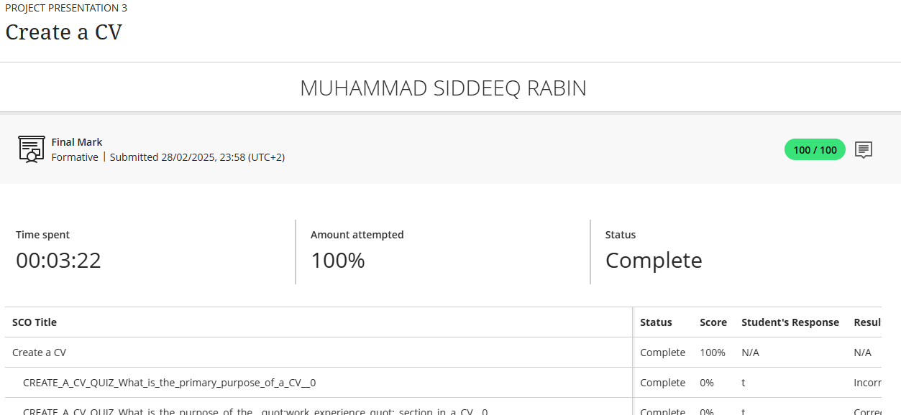

# GithubDigitalPortfolio

## Career Couenselling
### Evidence:

### Reflection:
**Situation**: I had to finish a career counselling module as part of the work preparation training, which also had a quiz to test myself.

**Task**: I had to do a quiz with multiple-choice questions and I had to show that I understood the fundamentals of career development.
.
**Action**: I studied the course material, paying close attention to the goals of professional goal-setting, the results of career counselling, and the distinction between hard and soft skills. 

**Result**: I answered every quiz question correctly, showing my understanding of career development fundamentals. 

## Skills and Interests:
### Evidence:

### Reflection:
**Situation**: I had to finish the Skills and Interests module, and I had to complete a quiz made to test my understanding of how skills, values, and interests affect career decisions.

**Task**: My task was to identify key concepts, such as the definition of skills, the role of values, and the nature of interests, and to recognize transferable skills across job roles.

**Action**: I reviewed the course content and reflected on how my own skills and interests align with potential careers.

**Result**: I successfully achieved a 100% score on the quiz and had a better understanding of how values can guide career decisions, how interests can suggest potential job satisfaction, and how transferable skills can provide flexibility in the job market. 

## Personality Assessment
### Evidence:

### Refelection:
**Situation**: I had to complete a Personality Assessment quiz focusing on helping learners understand how their personality traits align with different career fields.

**Task**: I had to demonstrate an understanding of many personality types—such as Realistic, Artistic, Investigative, Conventional and how these influence careers..

**Action**: I had to study the course materials on personality and career matching. I also had to apply this knowledge during the quiz.

**Result**: I achieved a 100% score, which confirmed my understanding of the connection between personality and career planning. 

## Create CV
### Evidence:

### Reflection:
**Situation**: I had to complete a quiz focused on the layout and content of a professional CV, including sections like work experience, education, and skills.

**Task**: I had to understand the components of an effective CV and how to organize and present information in a way that highlights my qualifications.

**Action**: I had to do a quiz on how each section of the CV contributes to the overall narrative of a candidate's experience and abilities.

**Result**: I achieved a 100% score, which reflected my understanding of CV writing. This process helped me structure my own CV more effectively.

## CV Submission
### Evidence:

### Refcletion: 
**Situation**: As the final step in the career readiness training, I was required to submit a complete application package, which included documents for review.

**Task**: I had to compile and submit my updated CV, proof of registration, identity document (ID), and matric certificate to demonstrate my preparedness for job or internship opportunities.

**Action**: I had to carefully review each document. I made final edits to my CV based on feedback from the CV creation module.

**Result**: I successfully submitted all required documents on time. This process helped reinforce the importance of administrative readiness and attention to detail when applying for opportunities.

